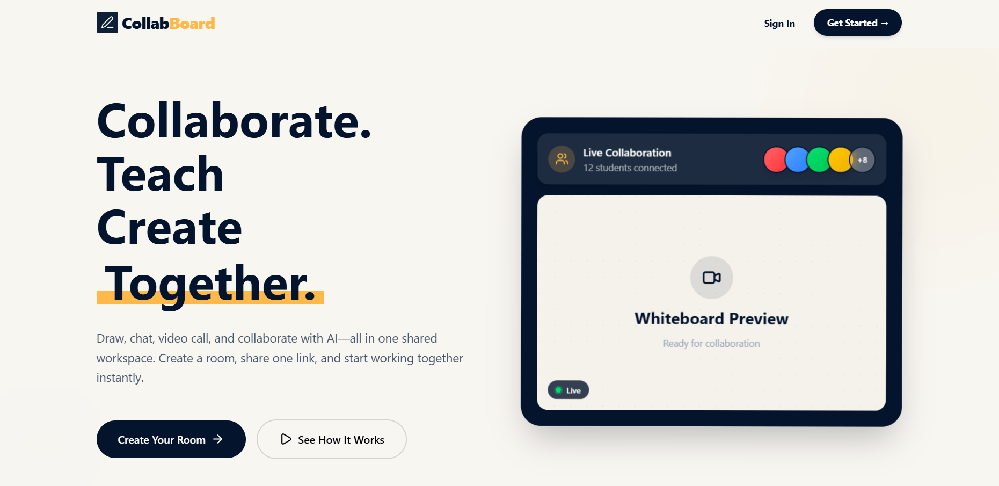
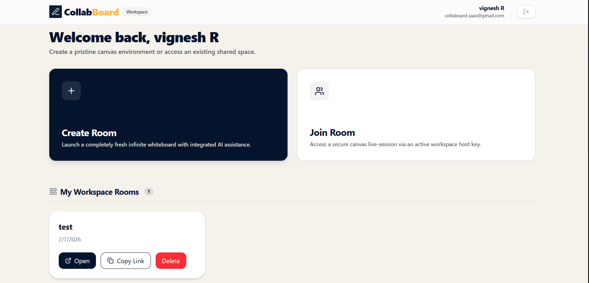
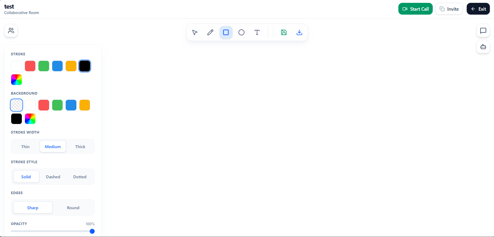
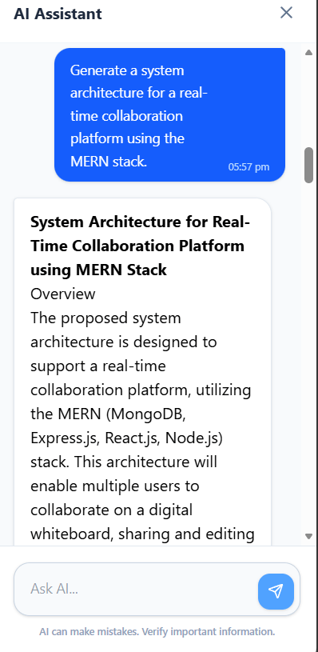
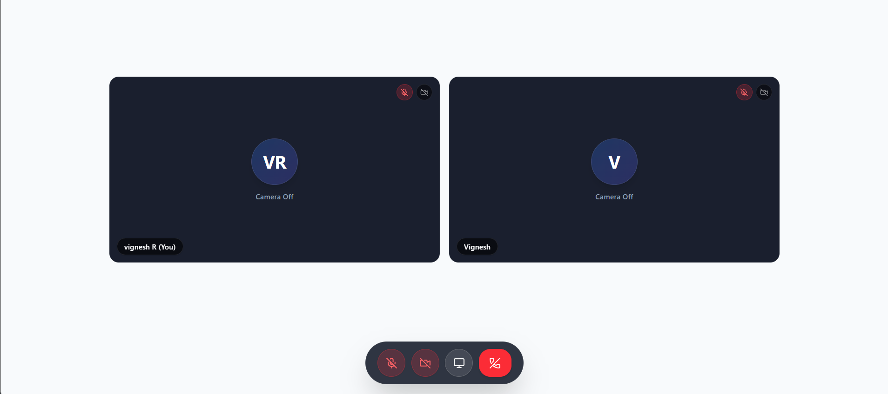

<div align="center">

# 📋 CollabBoard SaaS

### 🚀 Real-Time Collaboration Platform built with the MERN Stack

Collaborate • Draw • Chat • Video Call • Screen Share • AI Assistant

<br>


<br>

[](https://collabboard-saas.vercel.app/)
[](https://github.com/vikkyrg/collabboard-saas)

</div>

---

# 🚀 Project Preview

<p align="center">



</p>

> **CollabBoard SaaS** is a modern real-time collaboration platform that combines a collaborative whiteboard, live chat, HD video calling, screen sharing, and an AI Assistant into one seamless workspace.

---

# 📖 Overview

CollabBoard SaaS is a **full-stack real-time collaboration platform** built with the **MERN Stack**, designed to bring communication, collaboration, and productivity into a single workspace.

The platform enables **teachers, students, developers, and teams** to create secure collaboration rooms where they can draw together on a synchronized whiteboard, exchange messages through real-time chat, conduct HD video meetings, share screens, and leverage an integrated AI Assistant for brainstorming, coding assistance, and collaborative learning.

The application combines **real-time communication**, **interactive whiteboarding**, **video conferencing**, **AI-powered assistance**, and **secure authentication** into one seamless experience while maintaining scalable architecture and responsive design.

---

## 🎯 Key Objectives

- Provide a seamless real-time collaboration experience.
- Enable secure room-based teamwork.
- Deliver synchronized whiteboard interactions.
- Support live communication through chat and video.
- Improve productivity with AI-powered assistance.
- Demonstrate scalable full-stack MERN architecture.

---

# ✨ Features

CollabBoard SaaS brings together everything required for seamless online collaboration in a single platform.

---

## 🔐 Authentication & Security

| Feature | Description |
|---------|-------------|
| 🔑 JWT Authentication | Secure user authentication using JSON Web Tokens |
| 👤 User Registration | Register and login with email credentials |
| 🌐 Google Authentication | Sign in with Google OAuth |
| 🛡️ Protected Routes | Restricts unauthorized access to private pages |
| 👥 Role-Based Access | Supports role-based permissions within rooms |
| 🔗 Secure Invite Links | Join collaboration rooms using invite links |

---

## 🏠 Workspace Management

| Feature | Description |
|---------|-------------|
| ➕ Create Rooms | Instantly create collaborative workspaces |
| 🚪 Join Rooms | Join existing rooms through secure invite links |
| 👨‍👩‍👧‍👦 Multi-User Collaboration | Multiple participants can collaborate simultaneously |
| 📋 Dashboard | Manage all collaboration rooms from one place |
| 🗑️ Delete Rooms | Remove workspaces when no longer needed |

---

## 🎨 Collaborative Whiteboard

| Feature | Description |
|---------|-------------|
| ✏️ Freehand Drawing | Draw naturally with smooth strokes |
| 🔲 Rectangle Tool | Create rectangle shapes |
| ⚪ Circle Tool | Create circular shapes |
| 🔤 Text Tool | Add editable text anywhere on the canvas |
| 🖱️ Object Selection | Select, move, and edit objects |
| 🎨 Color Customization | Change stroke and fill colors |
| 📏 Stroke Controls | Customize width and style |
| 💾 Canvas Persistence | Whiteboard automatically saves changes |
| ⚡ Real-Time Sync | Instantly synchronize canvas across all users |

---

## 💬 Real-Time Communication

| Feature | Description |
|---------|-------------|
| 💬 Live Chat | Instant room-based messaging |
| 📜 Chat History | Persistent conversation history |
| 🖱️ Live Cursor Presence | View collaborators' cursor positions |
| ⚡ Socket.IO Sync | Real-time communication between users |

---

## 📹 Video Collaboration

| Feature | Description |
|---------|-------------|
| 📹 HD Video Calling | High-quality video meetings using Agora RTC |
| 🎤 Voice Calling | Crystal-clear audio communication |
| 🖥️ Screen Sharing | Share your screen with participants |
| 🎥 Camera Controls | Toggle camera on or off |
| 🎙️ Microphone Controls | Mute and unmute microphone |
| 👥 Participant Management | Collaborate with multiple users in a room |

---

## 🤖 AI Assistant

| Feature | Description |
|---------|-------------|
| 🤖 AI Chat | Integrated AI assistant for collaboration |
| 💡 Brainstorming | Generate ideas and solve problems |
| 💻 Coding Assistance | Get programming help instantly |
| 🏗️ Architecture Guidance | Generate system architecture suggestions |
| 📝 Conversation History | Maintain previous AI conversations |
| 📚 Learning Support | Enhance productivity and collaborative learning |

---

## 📱 User Experience

| Feature | Description |
|---------|-------------|
| 📱 Responsive Design | Optimized for desktop, tablet, and mobile devices |
| 🎯 Modern SaaS UI | Clean and intuitive user interface |
| ⚡ Fast Performance | Built with Vite for optimized loading |
| ⏳ Skeleton Loading | Smooth loading experience |
| 🎨 Professional Design | Consistent and modern UI components |

---

## 🌟 Highlights

- 🚀 Full-Stack MERN Architecture
- ⚡ Real-Time Collaboration using Socket.IO
- 🎨 Interactive Whiteboard powered by Fabric.js
- 📹 HD Video Calling & Screen Sharing with Agora RTC
- 🤖 AI-Powered Collaboration Assistant
- 🔐 Secure Authentication with JWT & Google OAuth
- ☁️ Cloud Deployment using Vercel, Render, and MongoDB Atlas

---

## 📸 Project Screenshots

Explore the major features of **CollabBoard SaaS**.

---

## 🏠 Landing Page

<p align="center">

</p>

A modern landing page introducing the collaboration platform.

---

## 📊 Dashboard

<p align="center">

</p>

Create rooms, join workspaces, and manage collaboration.

---

## 🎨 Collaborative Whiteboard

<p align="center">

</p>

Draw, edit, and collaborate on a synchronized whiteboard in real time.

---

## 🤖 AI Assistant

<p align="center">

</p>

Generate ideas, explain concepts, and get coding assistance using AI.

---

## 📹 Video Calling

<p align="center">

</p>

Communicate through HD video calling, voice chat, and screen sharing.

---

# 🏗️ System Architecture

The application follows a scalable MERN architecture with REST APIs for business logic and Socket.IO for real-time synchronization.

```text
                        ┌────────────────────┐
                        │    React Client    │
                        │  (Vite + Tailwind) │
                        └─────────┬──────────┘
                                  │
                     REST API + Socket.IO
                                  │
                    ┌─────────────▼─────────────┐
                    │      Express Server       │
                    │                           │
                    │ Authentication            │
                    │ Room Management           │
                    │ Whiteboard API            │
                    │ Chat API                  │
                    │ AI Service                │
                    │ Agora Token Service       │
                    └──────┬──────────┬─────────┘
                           │          │
             ┌─────────────▼───┐   ┌──▼──────────────┐
             │ MongoDB Atlas   │   │   Socket.IO     │
             │                 │   │ Real-Time Sync  │
             └─────────────────┘   └────────┬────────┘
                                            │
                           ┌────────────────▼─────────────┐
                           │ Live Whiteboard Synchronization │
                           │ Real-Time Chat                 │
                           │ Live Cursor Presence           │
                           │ Room Collaboration             │
                           └───────────────────────────────┘

                 External Services
        ┌───────────────────────────────────┐
        │ • Google OAuth                    │
        │ • Google Gemini AI               │
        │ • Agora RTC SDK                  │
        └───────────────────────────────────┘
```

---

# 🔄 Application Workflow

```text
              Register / Login
                      │
                      ▼
             Create or Join Room
                      │
                      ▼
        Invite Participants via Link
                      │
                      ▼
          Multiple Users Join Room
                      │
      ┌───────────────┼───────────────┐
      │               │               │
      ▼               ▼               ▼
 Whiteboard        Chat          Video Call
      │               │               │
      └───────────────┼───────────────┘
                      ▼
              AI Assistant Support
                      │
                      ▼
          Real-Time Collaboration
```

---

# 🌐 Deployment Architecture

```text
        Frontend
      Vercel Hosting
             │
             ▼
      React + Vite App
             │
      REST + Socket.IO
             │
             ▼
      Render Backend
             │
             ▼
      MongoDB Atlas
             │
             ├
             │
             └──────── Agora RTC
```

---

# 🛠️ Tech Stack

CollabBoard SaaS is built using a modern MERN stack combined with real-time communication and cloud deployment technologies.

---

## 💻 Frontend

| Technology | Purpose |
|------------|---------|
| React.js | User Interface |
| Vite | Build Tool |
| Tailwind CSS | Styling |
| React Router DOM | Client-side Routing |
| Axios | HTTP Requests |
| Socket.IO Client | Real-Time Communication |
| Fabric.js | Interactive Whiteboard |
| React Markdown | AI Response Rendering |

---

## ⚙️ Backend

| Technology | Purpose |
|------------|---------|
| Node.js | JavaScript Runtime |
| Express.js | REST API Framework |
| Socket.IO | Real-Time Communication |
| JWT | Authentication |
| Mongoose | MongoDB ODM |
| Google OAuth | Social Authentication |
| Google Gemini API | AI Assistant |
| Agora RTC SDK | Video Calling & Screen Sharing |

---

## 🗄️ Database

| Technology | Purpose |
|------------|---------|
| MongoDB Atlas | Cloud Database |

---

## ☁️ Deployment

| Service | Purpose |
|----------|---------|
| Vercel | Frontend Hosting |
| Render | Backend Hosting |
| MongoDB Atlas | Cloud Database |

---

# 📂 Project Structure

```text
CollabBoard-SaaS
│
├── client
│   ├── public
│   ├── src
│   │   ├── assets
│   │   ├── components
│   │   ├── context
│   │   ├── hooks
│   │   ├── layouts
│   │   ├── pages
│   │   ├── services
│   │   ├── utils
│   │   ├── App.jsx
│   │   └── main.jsx
│   ├── package.json
│   └── vite.config.js
│
├── server
│   ├── config
│   ├── controllers
│   ├── middleware
│   ├── models
│   ├── routes
│   ├── services
│   ├── sockets
│   ├── utils
│   ├── package.json
│   └── server.js
│
├── screenshots
│
├── README.md
│
└── .gitignore
```

---

# ⚙️ Getting Started

Follow the steps below to set up the project locally.

---

## 1️⃣ Clone the Repository

```bash
git clone https://github.com/vikkyrg/collabboard-saas.git

cd collabboard-saas
```

---

## 2️⃣ Install Frontend Dependencies

```bash
cd client

npm install
```

---

## 3️⃣ Install Backend Dependencies

```bash
cd ../server

npm install
```

---

## 4️⃣ Configure Environment Variables

Create a `.env` file inside the **server** directory.

---

## 5️⃣ Start the Backend

```bash
npm run dev
```

---

## 6️⃣ Start the Frontend

Open a new terminal.

```bash
cd client

npm run dev
```

---

## 7️⃣ Open the Application

```text
Frontend

http://localhost:5173
```

```text
Backend

http://localhost:5000
```

---

> **Important:** Never commit your `.env` file or sensitive credentials to GitHub.

---

# ☁️ Deployment

The application is deployed using modern cloud services.

| Component | Platform |
|-----------|----------|
| Frontend | Vercel |
| Backend | Render |
| Database | MongoDB Atlas |

---

## 🌍 Live Demo

Frontend

https://collabboard-saas.vercel.app/

---

## 💻 Source Code

https://github.com/vikkyrg/collabboard-saas

---

# 📚 Learning Outcomes

Developing **CollabBoard SaaS** was a valuable learning experience that strengthened both my frontend and backend development skills. Throughout this project, I gained hands-on experience designing and implementing scalable real-time applications while solving synchronization, state management, and collaboration challenges.

### Key Skills & Technologies

- ⚛️ Building scalable full-stack MERN applications
- ⚡ Implementing real-time communication using Socket.IO
- 🎨 Developing collaborative whiteboards with Fabric.js
- 📹 Integrating HD video calling and screen sharing using Agora RTC SDK
- 🤖 Integrating AI-powered assistance with Google Gemini API
- 🔐 Implementing JWT authentication and role-based authorization
- 🌐 Building secure REST APIs with Express.js
- 🍃 Designing MongoDB database schemas with Mongoose
- ☁️ Deploying production applications using Vercel, Render, and MongoDB Atlas
- 🚀 Designing modular, maintainable, and scalable application architecture

---

# 🗺️ Future Roadmap

The following features are planned for future releases.

| Status | Feature |
|---------|----------|
| ✅ | Real-Time Whiteboard |
| ✅ | Real-Time Chat |
| ✅ | AI Assistant |
| ✅ | Video Calling |
| ✅ | Screen Sharing |
| 🔲 | File Sharing |
| 🔲 | Whiteboard Templates |
| 🔲 | Collaborative Notes |
| 🔲 | Version History |
| 🔲 | Push Notifications |
| 🔲 | Mobile Application |
| 🔲 | Voice Notes |
| 🔲 | Calendar Integration |

---

# 🤝 Contributing

Contributions, suggestions, and improvements are always welcome.

If you would like to contribute:

1. Fork the repository
2. Create a new feature branch
3. Commit your changes
4. Push your branch
5. Open a Pull Request

---

# 📈 Project Highlights

- 🚀 Full-Stack MERN SaaS Application
- ⚡ Real-Time Collaboration Platform
- 🎨 Interactive Whiteboard
- 💬 Live Chat
- 📹 HD Video Calling
- 🖥️ Screen Sharing
- 🤖 AI Assistant
- 🔐 Secure Authentication
- ☁️ Cloud Deployment
- 📱 Responsive User Interface

---

# 👨‍💻 Author

<div align="center">

## Vignesh R

**Full Stack MERN Developer**

Passionate about building scalable full-stack web applications, real-time collaboration platforms, and modern user experiences.

📧 **Email:** rvikky05@gmail.com

<br>

[](https://vikkyrg.vercel.app/)

[](https://www.linkedin.com/in/vignesh-r-a634a2293/)

[](https://github.com/vikkyrg)

</div>

---

# ⭐ Show Your Support

If you found this project useful or interesting, please consider giving it a ⭐ on GitHub.

Your support motivates me to continue building and sharing more projects.

---

# 📄 License

This project is licensed under the **MIT License**.

Feel free to use, modify, and learn from this project.

---

<div align="center">

## 🚀 Thank You for Visiting!

If you enjoyed exploring **CollabBoard SaaS**, don't forget to ⭐ the repository and connect with me.

**Happy Coding! 💙**

</div>
